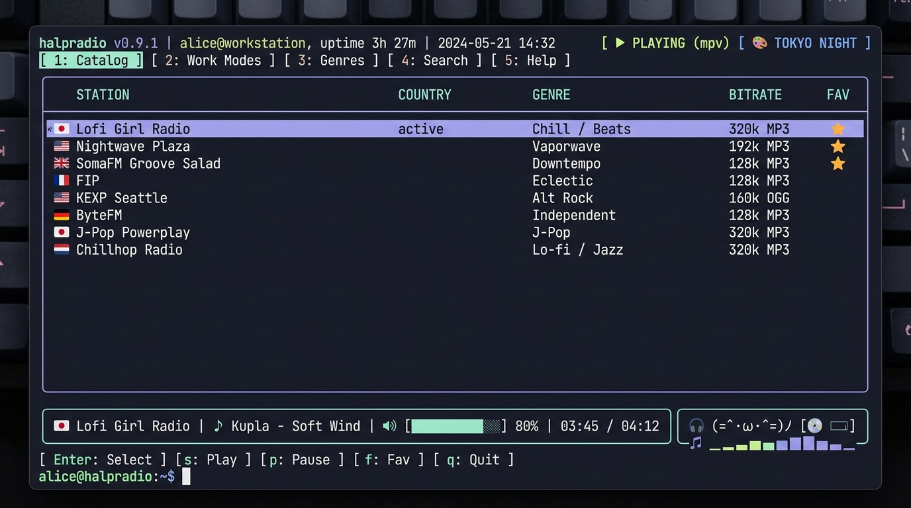
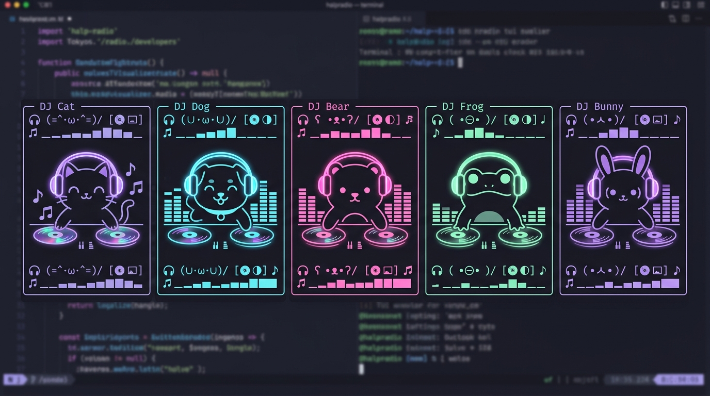

<div align="center">

```
  █ || █  ███  █   ███  ███  ███  ███  █   ███ 
  █═||═█ █───█ █   █──█ █──█ █──█ █──█ █  █───█
  █ || █ █───█ █── █──█ ███─ █──█ █──█ █  █───█
```

# 📻 halpradio

> **The ultimate terminal Internet Radio streaming application for developers who live in the command line.**  
> *Built with Go & Bubble Tea, featuring a LazyVim-inspired keyboard-driven interface.*

[](https://github.com/halpworld/halpradio/actions/workflows/ci.yml)
[](https://github.com/halpworld/halpradio/releases)
[](https://github.com/halpworld/homebrew-tap)
[](https://golang.org)
[](./LICENSE)
[](./stations.yaml)

</div>

---

## ⚡ Quickstart (Get listening in 10 seconds)

### macOS & Linux via Homebrew
```bash
brew install halpworld/tap/halpradio
halpradio
```

### One-Line Shell Installer (macOS & Linux)
```bash
curl -fsSL https://raw.githubusercontent.com/halpworld/halpradio/main/install.sh | bash
halpradio
```

---

## ✨ Features

- **⚡ LazyVim-Inspired UX**: Vim navigation (`j/k`, `h/l`, `g/G`, `Ctrl+u/d`, `/` search), split tab views, status badges, and Which-Key overlay (`?`).
- **🎵 Multi-Backend Audio Engine**: Auto-detects `mpv`, `vlc`/`cvlc`, `ffplay`, `mplayer`, or `mpg123`. Falls back to built-in **native Go audio engine** (`oto/v3` + `go-mp3`) with zero external binary dependencies required.
- **📻 30,000+ Online Stations**: Discover global internet radio via built-in **RadioBrowser API** integration or listen to curated bundled stations.
- **🐙 1-Key GitHub PR Export**: Press `p` on any station to copy a clean YAML snippet directly to your clipboard, ready for submitting a PR to [`stations.yaml`](./stations.yaml)!
- **🔒 Private / Custom Stations**: Add private stream URLs locally via interactive `[ a ] Add Station` dialog (saved in `~/.config/halpradio/stations.yaml`).
- **🎨 6 Vibrant Themes**: Tokyo Night, Catppuccin Mocha, Retro Synthwave '84, Nord, Gruvbox Dark, and Dracula.
- **🎧 Animated Animal DJ Visualizers**: Beat-reactive terminal DJs (Cat 🐱, Dog 🐶, Bear 🐻, Frog 🐸, Bunny 🐰) spinning vinyl, scratching decks, and pumping a smooth multi-frequency equalizer rack!
- **📻 Real-time ICY Metadata**: Displays live song title and artist information for supported Icecast/Shoutcast HTTP streams.
- **⭐ Favorites System**: Bookmark stations with `f` for 1-key instant access across restarts.

---

## 📺 Preview

<p align="center">
  
</p>

```
┌── 📻 HALPRADIO v0.0.3 ───────────────────────────────────────────────────────────── [ TOKYO NIGHT ] ┐
│                                                                                                    │
│  [ 1: Catalog (128) ]   [ 2: Work Modes ]   [ 3: Genres ]   [ 4: Online Search ]   [ ▶ PLAY ]      │
│ ────────────────────────────────────────────────────────────────────────────────────────────────── │
│  ▶  ⭐  🇫🇷 Lofi Girl Radio            [ Lofi / Beats ]             FR  •  320 kbps MP3            │
│     ⭐  🇺🇸 Nightwave Plaza            [ Vaporwave / Synth ]        US  •  192 kbps MP3            │
│        🇳🇱 Chillhop Music Radio        [ Lofi / Jazz ]              NL  •  320 kbps MP3            │
│        🇺🇸 SomaFM Groove Salad         [ Downtempo / Ambient ]      US  •  128 kbps MP3            │
│        🇺🇸 KEXP 90.3 FM                [ Indie / Alt Rock ]         US  •  160 kbps AAC            │
│        🇬🇧 BBC Radio 6 Music           [ Eclectic / Rock ]          GB  •  128 kbps AAC            │
│ ────────────────────────────────────────────────────────────────────────────────────────────────── │
│  🇫🇷 Lofi Girl Radio (Lofi / Beats)                                    🔊 [████████░░] 80%          │
│  ♪ Kupla & Philanthrope - Soft Wind           🎧 (=^･ω･^=)ﾉ [💿 ◓] ♫  ▂▃▄▅▆                        │
│ ────────────────────────────────────────────────────────────────────────────────────────────────── │
│  [?] WhichKey  [/] Search  [Space] Play/Pause  [v] Visualizer  [f] Fav  [t] Theme  [q] Quit        │
└────────────────────────────────────────────────────────────────────────────────────────────────────┘
```

---

## 🎧 Beat-Reactive Animal DJ Visualizers

<p align="center">
  
</p>

Press `v` anytime in **halpradio** to cycle through 5 animated animal DJs, classic bars, waveform, spectrum, or minimal meters:

| Visualizer Mode | Animal Character | DJ Booth & Live Equalizer Preview |
|---|---|---|
| `dj-cat` *(default)* | 🐱 **DJ Cat** | `🎧 (=^･ω･^=)ﾉ [💿 ◓] ♫  ▂▃▄▅▆` |
| `dj-dog` | 🐶 **DJ Dog** | `🎧  (∪･ω･∪) ﾉ [💿 ◑] ♫  ▂▃▄▅▆` |
| `dj-bear` | 🐻 **DJ Bear** | `🎧  ʕ •ᴥ•ʔ  ﾉ [💿 ◒] ♫  ▂▃▄▅▆` |
| `dj-frog` | 🐸 **DJ Frog** | `🎧  ( •⊖• ) ﾉ [💿 ◐] ♫  ▂▃▄▅▆` |
| `dj-bunny` | 🐰 **DJ Bunny** | `🎧 ( •ㅅ• )  ﾉ [💿 ◓] ♫  ▂▃▄▅▆` |
| `bars` | 📊 **Bars Equalizer** | `♫  ▂▃▄▅▆▇█▇▆▅▄▃▂  ♬` |
| `wave` | ∿ **Waveform** | `∿ _⎽⎼─⎻⎺▔⎺⎻─⎼⎽_ ∿` |
| `spectrum` | 🔊 **Spectrum** | `🔊 BASS ███ MID ███ TREB ███` |
| `minimal` | 🎚️ **Minimal VU** | `L:████░░░░ R:██████░░` |

- **Zero-Jitter Normalized Poses**: Every pose (head + arm + deck) has an exact, invariant width (24 visual columns) for smooth, stable rendering without horizontal shifting.
- **Harmonic Multi-Frequency Equalizer Rack**: Solid 6-bar mini-EQ (` ▂▃▄▅▆`) driven by harmonic frequency physics (sub-bass kick, mid melody, treble shimmer) with smooth attack and exponential decay.
- **Rhythmic Groove**: Head bobbing and turntable vinyl rotation (`◓`, `◑`, `◒`, `◐`) tempo-matched to audio playback.
- **Sleep State**: When stopped/paused, the DJ rests peacefully on the turntable (`🎧 (= - ω - =)..zzZ [ 💿 ] ⏹ STOPPED`).

---

## 📦 Installation Options

### Method 1: Homebrew (macOS & Linux) — Recommended

```bash
# Add official halpradio tap and install
brew tap halpworld/tap
brew install halpradio

# Or install directly with a single command:
brew install halpworld/tap/halpradio
```

To update in the future:
```bash
brew upgrade halpradio
```

---

### Method 2: One-Line Installer Script (macOS & Linux)

Automatically detects your OS and architecture (`arm64` / `amd64`), downloads the latest release binary, and installs it to `/usr/local/bin`:

```bash
curl -fsSL https://raw.githubusercontent.com/halpworld/halpradio/main/install.sh | bash
```

---

### Method 3: Pre-Compiled Binary Releases

Download pre-compiled standalone tarballs from the [GitHub Releases](https://github.com/halpworld/halpradio/releases) page:

| Platform | Architecture | Package |
|---|---|---|
| **macOS** | Apple Silicon (M1/M2/M3/M4) | `halpradio_*_darwin_arm64.tar.gz` |
| **macOS** | Intel x86_64 | `halpradio_*_darwin_amd64.tar.gz` |
| **Linux** | x86_64 | `halpradio_*_linux_amd64.tar.gz` |
| **Linux** | ARM64 / Raspberry Pi / AWS Graviton | `halpradio_*_linux_arm64.tar.gz` |

**Manual Installation Steps:**
```bash
# Example for macOS Apple Silicon:
curl -LO https://github.com/halpworld/halpradio/releases/latest/download/halpradio_0.0.3_darwin_arm64.tar.gz
tar -xzf halpradio_0.0.3_darwin_arm64.tar.gz
sudo mv halpradio /usr/local/bin/
```

---

### Method 4: Go Install

If you have Go 1.21+ installed:

```bash
go install github.com/halpworld/halpradio@latest
```

Ensure `$(go env GOPATH)/bin` is in your `$PATH`.

---

### Method 5: Build From Source

```bash
# Clone the repository
git clone https://github.com/halpworld/halpradio.git
cd halpradio

# Build executable
go build -o halpradio main.go

# Run halpradio
./halpradio
```

---

## 🔊 Audio Player Backends & Dependencies

`halpradio` works **completely out of the box** using its built-in **native Go audio engine** (`oto/v3` + `go-mp3`) with zero external binary dependencies required!

For enhanced stream stability and support for AAC / OGG formats, installing `mpv` (recommended) or `vlc` is optional but encouraged:

```bash
# macOS
brew install mpv

# Ubuntu / Debian
sudo apt install mpv

# Arch Linux
sudo pacman -S mpv

# Fedora
sudo dnf install mpv
```

`halpradio` will automatically detect `mpv` > `vlc` > `ffplay` > `native` on startup.

---

## ⌨️ Navigation & Keybindings (Vim Style)

Press `?` or `F1` anywhere in **halpradio** to open the floating **WhichKey Overlay**.

| Category | Keybinding | Action |
|---|---|---|
| **Navigation** | `j` / `k` or `↓` / `↑` | Move down / up |
| | `h` / `l` or `←` / `→` | Focus sidebar / main list or prev/next tab |
| | `1` - `4` | Direct jump to Tab (1: All, 2: Favs, 3: Cats, 4: Search) |
| | `g` / `G` | Jump to top / bottom of list |
| | `Ctrl+u` / `Ctrl+d` | Half page up / down |
| **Playback** | `Space` or `Enter` | Toggle Play / Pause selected station |
| | `s` | Stop audio stream |
| | `r` | Play random station |
| | `+` / `-` | Volume up / down (5% step) |
| | `m` | Mute / unmute |
| | `v` | Cycle visualizer (`dj-cat`, `dj-dog`, `dj-bear`, `dj-frog`, `dj-bunny`, `bars`, `wave`, `spectrum`, `minimal`) |
| **Catalog** | `f` | Toggle Favorite star ⭐ |
| | `/` | Live fuzzy search / filter stations |
| | `a` | Open **Add Custom Station** modal |
| | `e` / `d` | Edit / Delete local custom station |
| | `p` | Export station YAML snippet to clipboard for GitHub PR |
| **UI & Options**| `t` | Theme picker modal (Tokyo Night, Catppuccin, Synthwave, etc.) |
| | `?` / `F1` | Toggle WhichKey help overlay |
| | `q` / `Ctrl+c` | Quit halpradio |

---

## 🚩 Command-Line Flags

```bash
# Launch with explicit audio backend (mpv, vlc, ffplay, native)
halpradio -backend mpv

# Launch with specific color theme
halpradio -theme synthwave

# Display version
halpradio -version
```

---

## 📚 Technical Documentation

Explore detailed technical documentation in the [`docs/`](./docs) folder:

- 🏗️ **[Architecture Overview](./docs/ARCHITECTURE.md)**: Elm Architecture (Bubble Tea MVU), package breakdown, event loop, and concurrency model.
- 🎵 **[Audio Engine & Stream Player](./docs/AUDIO_PLAYER.md)**: Multi-backend auto-detection (`mpv`, `vlc`, `ffplay`, native Go), process lifecycle, and real-time ICY metadata extraction.
- 📻 **[Station Catalog & RadioBrowser Integration](./docs/STATION_MANAGEMENT.md)**: Station storage hierarchy (`stations.yaml`, local config, favorites), RadioBrowser API client, and PR export workflow.
- 🎨 **[Theme System & Audio Visualizers](./docs/THEME_SYSTEM.md)**: Lipgloss styling system, theme palettes, and TUI visualizer algorithms.
- ⚙️ **[Configuration & Keybindings](./docs/CONFIGURATION.md)**: Directory layout, `config.yaml` options, CLI flags, and complete keymap reference.
- 🤝 **[Developer & Contribution Guide](./docs/CONTRIBUTING.md)**: Developer setup, code standards, unit testing, and Pull Request checklist.
- 🤖 **[AI Agent Integration Guide](./docs/AGENTS.md)**: Guidelines for AI coding agents (**Google Antigravity** via [`AGENTS.md`](./AGENTS.md) & **Claude Code** via [`CLAUDE.md`](./CLAUDE.md)).

---

## 🤝 Contributing New Stations

We love community contributions! Expanding the catalog takes less than 30 seconds:

1. Select any station in **halpradio** and press `p` (copies formatted YAML to clipboard).
2. Paste the snippet into [`stations.yaml`](./stations.yaml) and submit a Pull Request.
3. See [CONTRIBUTING.md](./CONTRIBUTING.md) for detailed guidelines.

---

## 📄 License

This project is licensed under the [MIT License](./LICENSE).

---

<div align="center">
Made with ❤️ for terminal lovers and internet radio enthusiasts.
</div>
