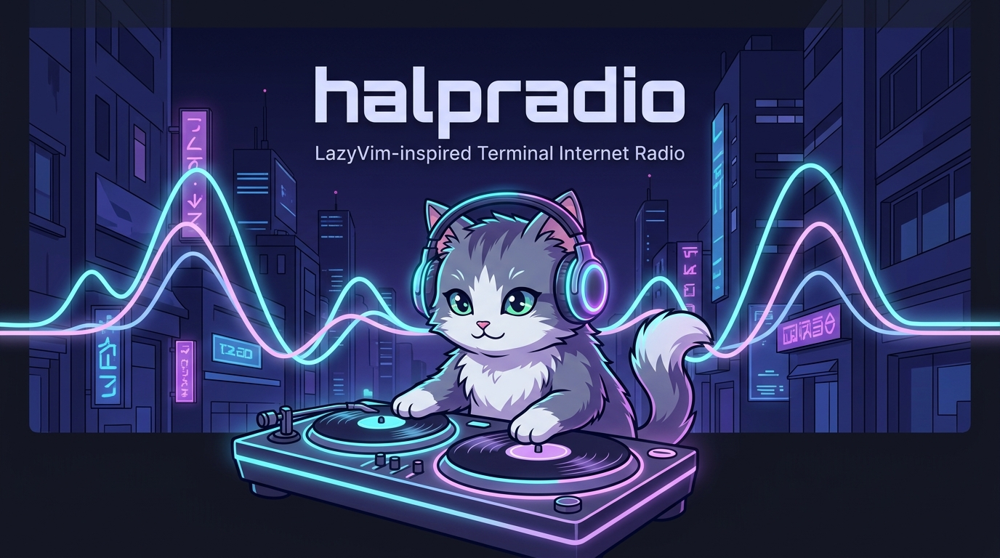
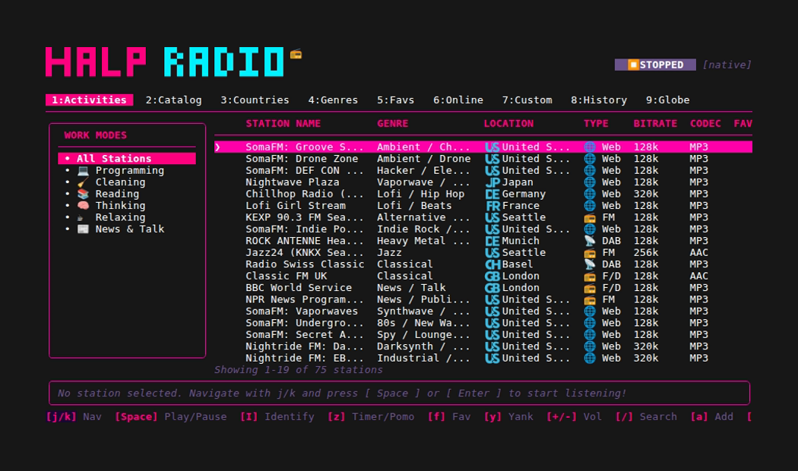
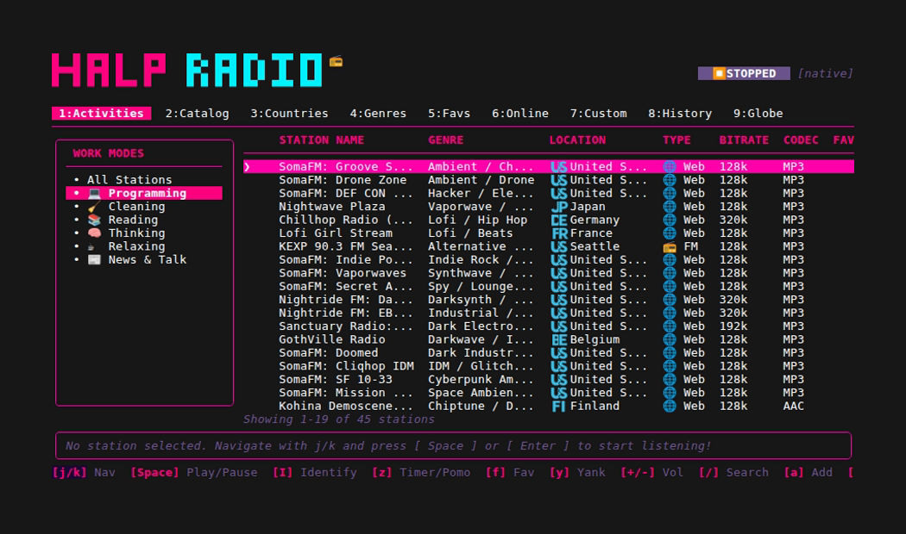
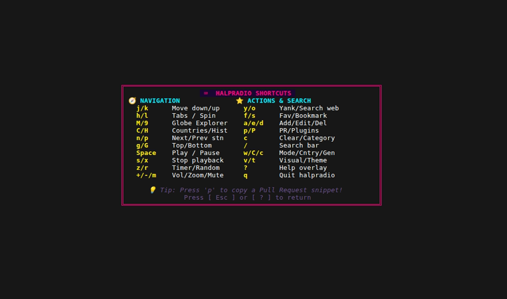

<div align="center">

<p align="center">
  
</p>

# 📻 halpradio

**The ultimate terminal Internet Radio streaming application for developers who live in the command line.**  
*Built with Go & Bubble Tea, featuring a LazyVim-inspired keyboard-driven interface.*

[](https://github.com/halpworld/halpradio/actions/workflows/ci.yml)
[](https://github.com/halpworld/halpradio/actions/workflows/ci.yml)
[](https://github.com/halpworld/halpradio/releases)
[](https://github.com/halpworld/homebrew-tap)
[](https://golang.org)
[](https://pkg.go.dev/github.com/halpworld/halpradio)
[](https://goreportcard.com/report/github.com/halpworld/halpradio)
[](./LICENSE)
[](./stations.yaml)
[](./CONTRIBUTING.md)

</div>

---

## ⚡ Quickstart (Get listening in 10 seconds)

### macOS & Linux via Homebrew
```bash
brew install halpworld/tap/halpradio
halpradio
```

### One-Line Shell Installer (macOS & Linux)
```bash
curl -fsSL https://raw.githubusercontent.com/halpworld/halpradio/main/install.sh | bash
halpradio
```

### 🐳 Instant Container Run (Docker)
```bash
docker run --rm -it --device /dev/snd halpworld/halpradio:latest
```

---

## 📺 Live Demo & Real Screenshots

<p align="center">
  
</p>

### 📻 Main Station Catalog & Live Audio Playback
<p align="center">
  
</p>

### 💼 Activity Modes & Split-View Sidebar
<p align="center">
  
</p>

### ⌨️ WhichKey Overlay & Theme Selection
<p align="center">
  
  &nbsp;&nbsp;
  
</p>

---

## ✨ Why halpradio? (Comparison with Other Terminal Players)

| Feature | 📻 **halpradio** | PyRadio | Curseradio | radio-active | mocp / cmus |
|---|:---:|:---:|:---:|:---:|:---:|
| **Zero-Dependency Audio Engine** | ✅ **Yes** (`oto/v3` Go native) | ❌ (requires MPV/VLC) | ❌ (requires MPV) | ❌ (requires FFmpeg) | ❌ (C daemons) |
| **Linux MPRIS v2 & Media Keys** | ✅ **Native D-Bus + `playerctl`** | ❌ None | ❌ None | ❌ None | ⚠️ Basic MPRIS |
| **Song Change Desktop Notifications** | ✅ **Native macOS/Linux/Win + Dedupe** | ❌ None | ❌ None | ❌ None | ❌ None |
| **CLI & Hotkey Remote (`halpradio remote`)** | ✅ **macOS Shortcuts, Raycast, tmux** | ❌ None | ❌ None | ❌ None | ⚠️ Socket |
| **Pomodoro & Sleep Timers (`z`)** | ✅ **Intervals, Station Switch & OS Notify** | ❌ None | ❌ None | ❌ None | ⚠️ Basic sleep |
| **Beat-Reactive Animated Visualizers** | ✅ **5 Animal DJs + EQ Spectrum** | ❌ None | ❌ None | ❌ None | ⚠️ Basic VU |
| **Live ICY Metadata (Song / Artist)** | ✅ **Real-time Async Extraction** | ⚠️ Partial | ❌ None | ⚠️ Partial | ⚠️ Track only |
| **30,000+ Online Station Search** | ✅ **Built-in RadioBrowser API** | ❌ Manual list | ❌ TuneIn scrap | ⚠️ Search only | ❌ Local files |
| **Vim Navigation & Which-Key (`?`)** | ✅ **Full Vim Modal UX** | ⚠️ Basic keys | ⚠️ Basic keys | ❌ Non-modal | ⚠️ Custom maps |
| **Modern Theme Engine** | ✅ **6 Themes** (Tokyo Night, Synthwave, etc.) | ⚠️ Curses colors | ❌ Basic curses | ❌ Basic | ⚠️ Simple skins |
| **1-Key PR Clipboard Export (`p`)** | ✅ **Instant YAML snippet for PRs** | ❌ Manual | ❌ Manual | ❌ Manual | ❌ N/A |

---

## 🎧 Beat-Reactive Animal DJ Visualizers

Press `v` anytime in **halpradio** to cycle through 5 animated animal DJs, classic bars, waveform, spectrum, or minimal meters:

| Visualizer Mode | Animal Character | DJ Booth & Live Equalizer Render |
|---|---|---|
| `dj-cat` *(default)* | 🐱 **DJ Cat** | `🎧 (=^･ω･^=)ﾉ [💿 ◓] ♫  ▂▃▄▅▆` |
| `dj-dog` | 🐶 **DJ Dog** | `🎧  (∪･ω･∪) ﾉ [💿 ◑] ♫  ▂▃▄▅▆` |
| `dj-bear` | 🐻 **DJ Bear** | `🎧  ʕ •ᴥ•ʔ  ﾉ [💿 ◒] ♫  ▂▃▄▅▆` |
| `dj-frog` | 🐸 **DJ Frog** | `🎧  ( •⊖• ) ﾉ [💿 ◐] ♫  ▂▃▄▅▆` |
| `dj-bunny` | 🐰 **DJ Bunny** | `🎧 ( •ㅅ• )  ﾉ [💿 ◓] ♫  ▂▃▄▅▆` |
| `bars` | 📊 **Bars Equalizer** | `♫  ▂▃▄▅▆▇█▇▆▅▄▃▂  ♬` |
| `wave` | ∿ **Waveform** | `∿ _⎽⎼─⎻⎺▔⎺⎻─⎼⎽_ ∿` |
| `spectrum` | 🔊 **Spectrum** | `🔊 BASS ███ MID ███ TREB ███` |
| `minimal` | 🎚️ **Minimal VU** | `L:████░░░░ R:██████░░` |

- **Zero-Jitter Normalized Poses**: Every pose (head + arm + deck) has an exact, invariant width (24 visual columns) for smooth, stable rendering without horizontal shifting.
- **Harmonic Multi-Frequency Equalizer Rack**: Solid 6-bar mini-EQ (` ▂▃▄▅▆`) driven by harmonic frequency physics (sub-bass kick, mid melody, treble shimmer) with smooth attack and exponential decay.
- **Rhythmic Groove**: Head bobbing and turntable vinyl rotation (`◓`, `◑`, `◒`, `◐`) tempo-matched to audio playback.
- **Sleep State**: When stopped/paused, the DJ rests peacefully on the turntable (`🎧 (= - ω - =)..zzZ [ 💿 ] ⏹ STOPPED`).

---

## ⏱️ Developer Pomodoro Focus Mode & Sleep Timer

Press `z` or `Z` anywhere in **halpradio** to open the **Timer & Pomodoro Focus Modal**:

<p align="center">
  <b>🍅 Pomodoro Focus Sprints &nbsp;|&nbsp; ☕ Short & Long Breaks &nbsp;|&nbsp; ⏳ Sleep Timer with Volume Fade-Out</b>
</p>

### 🍅 Developer Pomodoro Mode
- **Sprint & Rest Intervals**: Seamlessly cycle between Focus sessions (default: `25 min`), Short Breaks (`5 min`), and Long Breaks (`15 min` after 4 completed cycles).
- **Auto Station Switching**: Automatically tune into your deep focus station (e.g. *Lofi Girl / Synthwave*) during sprints, and switch to relaxing sounds (e.g. *Ambient Cafe / Jazz*) or silence during breaks.
- **Live Visual Countdown**: Real-time progress bar and badges displayed directly in the playerbar (`🍅 18:42 (#2/4)` / `☕ 04:50 (Break)`), statusbar, and OSC native terminal tab title (`[🍅 18:42] ▶ Track | halpradio`).

### ⏳ Sleep Timer & Smooth Volume Fade-Out
- **Quick Presets**: Instant `15 min`, `30 min`, `45 min`, `60 min`, `90 min`, or custom minute countdowns.
- **Graceful Volume Fade-Out**: Smoothly scales audio volume down to 0% during the final 10 seconds before stopping playback, keeping your initial volume preference intact for next morning.

### 🔔 System Desktop Events & OS Integration
- **Cross-Platform Desktop Notifications**: Silent native banner notifications on macOS (`osascript`), Linux (`notify-send`), and Windows (PowerShell toast notifications).
- **Terminal Bell (`\a`)**: Optional audio bell cue on interval transitions.
- **Custom Shell Event Hook**: Execute your own shell script on timer transitions with rich environment variables (`HALPRADIO_EVENT`, `HALPRADIO_PHASE`, `HALPRADIO_CYCLE`, `HALPRADIO_STATION_NAME`), perfect for triggering macOS Focus Mode, smart desk lights, Waybar/Polybar, or Slack status!

---

## 📦 Complete Installation Options

### Method 1: Homebrew (macOS & Linux) — Recommended

```bash
# Install directly from the official tap
brew install halpworld/tap/halpradio
```

To upgrade anytime:
```bash
brew upgrade halpradio
```

---

### Method 2: One-Line Installer Script (macOS & Linux)

Automatically detects your OS and architecture (`arm64` / `amd64`), downloads the latest release binary, and installs it to `/usr/local/bin`:

```bash
curl -fsSL https://raw.githubusercontent.com/halpworld/halpradio/main/install.sh | bash
```

---

### Method 3: Pre-Compiled Binary Releases

Download pre-compiled standalone tarballs from the [GitHub Releases](https://github.com/halpworld/halpradio/releases) page:

| Platform | Architecture | Package |
|---|---|---|
| **macOS** | Apple Silicon (M1/M2/M3/M4) | `halpradio_*_darwin_arm64.tar.gz` |
| **macOS** | Intel x86_64 | `halpradio_*_darwin_amd64.tar.gz` |
| **Linux** | x86_64 | `halpradio_*_linux_amd64.tar.gz` |
| **Linux** | ARM64 / Raspberry Pi / AWS Graviton | `halpradio_*_linux_arm64.tar.gz` |
| **Windows** | x86_64 / ARM64 | `halpradio_*_windows_*.zip` |

---

### Method 4: Go Install

If you have Go 1.21+ installed:

```bash
go install github.com/halpworld/halpradio@latest
```

---

### Method 5: Build From Source

```bash
git clone https://github.com/halpworld/halpradio.git
cd halpradio
go build -o halpradio main.go
./halpradio
```

For Arch Linux (AUR), Scoop (Windows), or Nix packaging, see the [Packaging Guide](./docs/PACKAGING.md).

---

## 🔊 Audio Player Backends & Codec Support

`halpradio` works **completely out of the box** using its built-in **native Go audio engine** (`oto/v3` + `go-mp3`) with zero external binary dependencies required!

| Audio Backend | Priority | MP3 | AAC | OGG | FLAC | HLS / M3U8 | Dependencies |
|---|:---:|:---:|:---:|:---:|:---:|:---:|:---:|
| **mpv** *(recommended)* | 1st | ✅ | ✅ | ✅ | ✅ | ✅ | `brew install mpv` / `apt install mpv` |
| **vlc / cvlc** | 2nd | ✅ | ✅ | ✅ | ✅ | ✅ | `brew install vlc` / `apt install vlc` |
| **ffplay** | 3rd | ✅ | ✅ | ✅ | ✅ | ✅ | `ffmpeg` |
| **native (Go oto)** | 4th | ✅ | ❌ | ❌ | ❌ | ❌ | **Zero dependencies (built-in)** |

`halpradio` will automatically detect `mpv` > `vlc` > `ffplay` > `native` on startup. You can override this anytime with the `-backend` flag:

```bash
halpradio -backend mpv
halpradio -backend native
```

---

## 🖥️ Desktop Integration: MPRIS v2, Media Keys & CLI Remote

`halpradio` provides deep desktop operating system integration across **macOS** and **Linux**:

### 🐧 Linux MPRIS v2 D-Bus Interface
Registers standard D-Bus service `org.mpris.MediaPlayer2.halpradio` on the session bus.
- Control halpradio seamlessly from your keyboard media keys, GNOME / KDE Plasma media panels, and Waybar/Polybar modules.
- Supports standard MPRIS methods: `PlayPause`, `Play`, `Pause`, `Stop`, `Next`, `Previous`, `Quit`.
- Control from terminal: `playerctl play-pause`, `playerctl next`, `playerctl previous`, `playerctl stop`.

### 🍎 macOS & CLI Remote Control (`halpradio remote`)
Control playback instantly without focusing the terminal window:
```bash
halpradio remote play-pause  # Toggle play / pause
halpradio remote next        # Jump to next station
halpradio remote prev        # Jump to previous station
halpradio remote volup       # Volume +5%
halpradio remote voldown     # Volume -5%
halpradio remote mute        # Toggle mute
halpradio remote random      # Play random station
halpradio remote status      # Inspect playback status
```
- **macOS Shortcuts / Raycast / Alfred**: Map `halpradio remote play-pause` to hardware F7/F8/F9 or hotkeys.
- **tmux**: Add `bind-key P run-shell "halpradio remote play-pause"` to `~/.tmux.conf`.

### 📢 Song Change Desktop Notifications
Whenever a radio station broadcasts a new track title via ICY metadata, `halpradio` fires a native desktop notification banner:
- **Title**: `📻 halpradio — [Station Name]`
- **Body**: `🎶 [Artist] - [Title]`
- Built-in deduplication ensures zero spam.
- Toggle via `-notifications=false` or `song_notifications: false` in `config.yaml`.

---

## ⌨️ Navigation & Keybindings (Vim & Media Style)

Press `?` or `F1` anywhere in **halpradio** to open the floating **WhichKey Overlay**.

| Category | Keybinding | Action |
|---|---|---|
| **Navigation** | `j` / `k` or `↓` / `↑` | Move down / up |
| | `n` / `]` | Jump and play **Next station** in active list |
| | `N` / `[` | Jump and play **Previous station** in active list |
| | `h` / `l` or `←` / `→` | Focus sidebar / main list or prev/next tab |
| | `1` - `7` | Direct jump to Tab (1: Catalog, 2: Activities, 3: Genres, 4: Favorites, 5: Online, 6: Custom, 7: History) |
| | `H` | Jump directly to Track History tab |
| | `g` / `G` | Jump to top / bottom of list |
| | `Ctrl+u` / `Ctrl+d` | Half page up / down |
| **Discovery & Sharing** | `y` | Yank / copy track metadata (`Artist - Title`) to system clipboard |
| | `o` | Open streaming search in default web browser (Spotify, YT Music, Apple, DDG, Google) |
| | `s` | Star / bookmark track to `~/.config/halpradio/saved_tracks.txt` (on History tab) |
| | `c` | Clear track history log (on History tab) |
| | `p` | Export station YAML snippet to clipboard for GitHub PR |
| **Playback** | `Space` / `Enter` / ⏯️ | Toggle Play / Pause selected station (or tune in from history) |
| | `s` / `x` / ⏹️ | Stop audio stream (on station tabs) |
| | `z` / `Z` | Open **Sleep Timer & Pomodoro Focus** modal |
| | `r` / `R` | Play random station |
| | `+` / `-` / `=` / `>` | Volume up / down (5% step, supports ANSI, ISO, AZERTY, QWERTZ) |
| | `m` / `M` / `0` | Mute / unmute |
| | `v` | Cycle visualizer (`dj-cat`, `dj-dog`, `dj-bear`, `dj-frog`, `dj-bunny`, `bars`, `wave`, `spectrum`, `minimal`) |
| **Catalog** | `f` | Toggle Favorite star ⭐ |
| | `/` | Live fuzzy search / filter stations |
| | `w` / `c` | Jump & filter by Activity Mode / Genre Category |
| | `a` | Open **Add Custom Station** modal |
| | `e` / `d` | Edit / Delete local custom station |
| **UI & Options**| `t` | Theme picker modal (Tokyo Night, Catppuccin, Synthwave, etc.) |
| | `?` / `F1` | Toggle WhichKey help overlay |
| | `q` / `Ctrl+c` | Quit halpradio |

---

## 🎨 Themes & Customization

Switch themes on the fly by pressing `t` or pass `-theme <name>` via CLI:

- 🌌 **Tokyo Night** (`tokyonight`) — Neon blue and purple developer aesthetic
- ☕ **Catppuccin Mocha** (`catppuccin`) — Soothing pastel dark palette
- 🌆 **Retro Synthwave '84** (`synthwave`) — Vibrant neon magenta and cyan
- ❄️ **Nord** (`nord`) — Cool arctic blue minimalism
- 🪵 **Gruvbox Dark** (`gruvbox`) — Warm retro terminal tones
- 🧛 **Dracula** (`dracula`) — High-contrast gothic vampire theme

---

## 📻 Curated Station Categories & Activity Modes

Explore hundreds of curated streams across diverse activity moods and global genres:

- 🎧 **Focus & Flow**: Lofi Girl Radio, Chillhop Music, SomaFM Groove Salad, DEF CON Radio, Nightwave Plaza
- ☕ **Acoustic & Coffee**: Cafe De Paris, Smooth Jazz Florida, Swiss Classic, Instrumental Ambient
- 🚀 **High Energy Coding**: Synthwave 1980s, Cyberpunk FM, Goa Psytrance, Digitally Imported (DI.FM)
- 🌏 **Global Radio**: BBC Radio 6 Music (UK), KEXP 90.3 FM Seattle (US), Radio Paradise (US), FM 802 Osaka (JP), Big B Radio K-Pop (KR), FIP Radio (FR), Triple J (AU)
- 📰 **News & Public Broadcasts**: NPR 24 Hour Program Stream, BBC World Service, Deutschlandfunk

---

## 📚 Technical Documentation

Explore detailed technical documentation in the [`docs/`](./docs) folder:

- 🏗️ **[Architecture Overview](./docs/ARCHITECTURE.md)**: Elm Architecture (Bubble Tea MVU), package breakdown, event loop, and concurrency model.
- 🎵 **[Audio Engine & Stream Player](./docs/AUDIO_PLAYER.md)**: Multi-backend auto-detection (`mpv`, `vlc`, `ffplay`, native Go), process lifecycle, and real-time ICY metadata extraction.
- 📻 **[Station Catalog & RadioBrowser Integration](./docs/STATION_MANAGEMENT.md)**: Station storage hierarchy (`stations.yaml`, local config, favorites), RadioBrowser API client, and PR export workflow.
- 🎨 **[Theme System & Audio Visualizers](./docs/THEME_SYSTEM.md)**: Lipgloss styling system, theme palettes, and TUI visualizer algorithms.
- ⚙️ **[Configuration & Keybindings](./docs/CONFIGURATION.md)**: Directory layout, `config.yaml` options, CLI flags, and complete keymap reference.
- 📦 **[Packaging & Distribution Guide](./docs/PACKAGING.md)**: Specifications for Homebrew, Arch Linux AUR, Docker, Scoop, and Nix.
- 🤝 **[Developer & Contribution Guide](./docs/CONTRIBUTING.md)**: Developer setup, code standards, unit testing, and Pull Request checklist.
- 🤖 **[AI Agent Integration Guide](./docs/AGENTS.md)**: Guidelines for AI coding agents (**Google Antigravity** via [`AGENTS.md`](./AGENTS.md) & **Claude Code** via [`CLAUDE.md`](./CLAUDE.md)).

---

## 🤝 Contributing New Stations

We love community contributions! Expanding the catalog takes less than 30 seconds:

1. Select any station in **halpradio** and press `p` (copies formatted YAML to clipboard).
2. Paste the snippet into [`stations.yaml`](./stations.yaml) and submit a [Pull Request](https://github.com/halpworld/halpradio/pulls).
3. Alternatively, submit a [Station Suggestion Issue](https://github.com/halpworld/halpradio/issues/new?template=station_request.yml).
4. See [CONTRIBUTING.md](./CONTRIBUTING.md) for full guidelines.

---

## 📄 License

This project is licensed under the [GNU General Public License v3.0 (GPL-3.0)](./LICENSE).

---

<div align="center">
Made with ❤️ for terminal lovers and internet radio enthusiasts.
</div>
