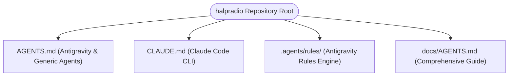

# AI Agent Integration Guide 🤖

`halpradio` is designed to be fully AI-agent-friendly. Whether you are using **Google Antigravity** or **Claude Code**, this document explains how AI agents interact with the repository, discover rules, execute commands, and contribute safely.

---

## 🧭 Agent Instruction File Hierarchy

AI agents automatically discover configuration files at the root of the workspace:



| Agent Platform | Entry Configuration File | Primary Discovery Location | Special Capabilities |
|---|---|---|---|
| **Google Antigravity** | `AGENTS.md` / `.agents/rules/` | Root `AGENTS.md` & `.agents/` directory | Subagents (`research`, `self`), Slash commands (`/plan`, `/goal`), Artifact generation, Task scheduling |
| **Claude Code** | `CLAUDE.md` | Root `CLAUDE.md` | Context-compact CLI commands, test execution loops, file edits |

---

## ⚡ Google Antigravity Workflow

### 1. Customization & Rules Loading
Antigravity automatically discovers instructions from:
- Root [`AGENTS.md`](../AGENTS.md)
- Workspace customizations root: `.agents/rules/`
- Built-in skills (`agy-customizations`, `antigravity-guide`)

### 2. Subagent Delegation
When working on large refactors or complex investigations:
- **`research` subagent**: Delegate codebase exploration, API research, or dependency analysis to `research` so context history remains clean.
- **`self` subagent**: Delegate isolated build, test, or scratch file generation tasks.

### 3. Recommended Slash Commands
Agents working with users in Antigravity should suggest slash commands when applicable:
- `/plan`: Use when planning complex structural changes (e.g. adding new audio backends or modifying the Elm update loop).
- `/goal`: Use when executing background autonomous tasks.
- `/grill-me`: Use when aligning with the developer on UI/UX preferences or modal design decisions.
- `/learn`: Use when saving custom workflow preferences for future runs.

### 4. Artifact & Log Management
Antigravity stores artifacts, scratch scripts, and transcripts in `<appDataDir>/brain/<conversation-id>/`. Architectural proposals or complex test output reports should be saved as markdown artifacts.

---

## 🔮 Claude Code Workflow

### 1. Execution Loop
Claude Code reads [`CLAUDE.md`](../CLAUDE.md) on launch to understand the build and test toolchain.

### 2. Standard Development Commands
```bash
# Build binary
go build -o halpradio main.go

# Execute tests
go test ./...

# Format and vet
gofmt -s -w .
go vet ./...
```

### 3. Test-Driven Verification
Claude Code agents must execute `go test ./...` after every code modification to verify zero regression across `pkg/player`, `pkg/radio`, and `pkg/ui`.

---

## 📏 Core Engineering Guidelines for All Agents

1. **Mutex Concurrency Safety**:
   - `pkg/player/player.go` handles real-time HTTP streaming and audio process lifecycle.
   - Always acquire `m.mu.Lock()` when modifying player manager state.
   - Dispatch async events back to Bubble Tea using `program.Send()` or `tea.Cmd`.

2. **Pure UI Component Rendering**:
   - Files under `pkg/ui/components/` must be side-effect-free renderers.
   - All state mutations must occur in `pkg/ui/update.go`.

3. **Theme Token Compliance**:
   - Never write hardcoded HEX colors in UI files.
   - Always reference active theme tokens (`m.theme.Primary`, `m.theme.Border`, `m.theme.Playing`, etc.) from `pkg/theme/theme.go`.

4. **Resilient Error Handling**:
   - Do not swallow errors or return dummy fallbacks silently.
   - Set status to `StatusError` or output informative error messages in the status bar. Never call `panic()`.

5. **Empirical Verification**:
   - Never claim a bug fix or feature is complete without running `go test ./...` and `go build main.go`.
