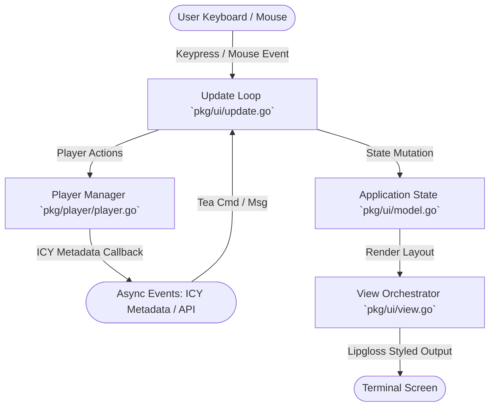

# Architecture Overview 🏗️

`halpradio` is a keyboard-driven, terminal-based Internet Radio streaming application built in Go using the **Bubble Tea** TUI framework and **Lipgloss** styling library.

---

## 📐 Application Design Pattern (Elm Architecture)

`halpradio` strictly follows the Model-View-Update (MVU) pattern mandated by [Bubble Tea](https://github.com/charmbracelet/bubbletea):



### Core Components of MVU:

1. **Model ([`pkg/ui/model.go`](../pkg/ui/model.go))**  
   Houses all application state including:
   - Active tab index (`1: Activities`, `2: Catalog`, `3: Genres`, `4: Favorites`, `5: RadioBrowser`, `6: Custom`, `7: History`)
   - Station catalog & store handle ([`pkg/radio/store.go`](../pkg/radio/store.go))
   - Audio player handle ([`pkg/player/player.go`](../pkg/player/player.go))
   - UI focus states (`FocusMainList`, `FocusSidebar`), list cursor selections, and search queries
   - Active modals (Theme picker, Add station modal, WhichKey overlay, PR export modal)
   - Current theme token definition ([`pkg/theme/theme.go`](../pkg/theme/theme.go))

2. **Update ([`pkg/ui/update.go`](../pkg/ui/update.go))**  
   Processes user inputs (LazyVim keybindings, search input) and asynchronous messages:
   - `TrackUpdatedMsg`: Fired when ICY metadata detects a new song title.
   - `RadioBrowserResultsMsg`: Fired when online station search returns results.
   - `tea.WindowSizeMsg`: Terminal resize events to dynamically compute layout dimensions.
   - `tea.SetWindowTitle`: Dispatches OSC 2 escape sequences to update native terminal window/tab titles dynamically.

3. **View ([`pkg/ui/view.go`](../pkg/ui/view.go))**  
   Orchestrates sub-component renderers and applies active theme colors to construct the terminal frame.

---

## 📦 Package Hierarchy & Responsibilities

```
halpradio/
├── main.go               # Entry point; embeds stations.yaml & invokes app.Run()
├── stations.yaml         # Bundled station catalog
├── docs/                 # Detailed technical documentation
└── pkg/
    ├── app/              # CLI flag parsing, configuration loading & app bootstrap
    ├── player/           # Multi-backend audio playback engine & ICY stream reader
    ├── plugin/           # Wazero Wasm sandboxing engine, capability permissions, host API, registry client
    ├── radio/            # Station catalog store, YAML parser, & RadioBrowser client
    ├── theme/            # Theme definitions & color palette registry
    ├── timer/            # Pomodoro focus engine, sleep timer with volume fade, and OS event dispatcher
    ├── ui/               # Main Bubble Tea Model, Update, View, and Keymap logic
    │   └── components/   # Modular UI sub-views (Header, StationList, PlayerBar, Visualizer, Modals)
    └── util/             # OS configuration directory resolution & clipboard utilities
```

### Module Breakdown:

| Package | Key Types / Files | Responsibilities |
|---|---|---|
| [`pkg/app`](../pkg/app/app.go) | `Run()`, `RunPluginCLI()` | Parses CLI flags (`--backend`, `--theme`, `--version`), handles CLI subcommands (`remote`, `plugin`), sets up store, instantiates `player.Manager`, initializes `tea.Program`. |
| [`pkg/player`](../pkg/player/player.go) | `Player`, `Manager`, `TrackInfo` | Detects audio CLI backends (`mpv`, `vlc`, `ffplay`, etc.) or falls back to native Go audio. Runs ICY metadata streaming goroutine. |
| [`pkg/plugin`](../pkg/plugin/manager.go) | `Manager`, `Sandbox`, `Manifest`, `RegistryClient` | Executes sandboxed WebAssembly plugins via Wazero with capability checks (`network`, `storage`, `events`). Fetches and verifies official registry packages. |
| [`pkg/radio`](../pkg/radio/store.go) | `Store`, `Station`, `RadioBrowserClient` | Manages bundled, local, and favorite stations. Interfaces with the external RadioBrowser HTTP API. |
| [`pkg/theme`](../pkg/theme/theme.go) | `Theme`, `GetTheme()` | Defines 6 color palettes (Tokyo Night, Catppuccin, Synthwave, Nord, Gruvbox, Dracula). |
| [`pkg/timer`](../pkg/timer/timer.go) | `Timer`, `Event`, `DispatchEvent()` | Powers Pomodoro focus interval state machine, sleep timer countdown with volume fade-out, and cross-platform desktop notifications. |
| [`pkg/ui`](../pkg/ui/model.go) | `Model`, `KeyMap`, `Update()` | Coordinates global navigation state, search filtering, modal popups, and keybindings. |
| [`pkg/ui/components`](../pkg/ui/components/) | `Header`, `StationList`, `PlayerBar`, `Visualizer`, `Modals` | Render pure, reusable Lipgloss UI components. |
| [`pkg/util`](../pkg/util/config.go) | `GetConfigDir()`, `CopyToClipboard()` | Provides platform-agnostic file paths for `~/.config/halpradio/` and clipboard integration. |

---

## ⚡ Data Flow & Concurrency

1. **Audio Playback Subprocess / Goroutine**:  
   Audio playback runs asynchronously in a separate goroutine managed by `player.Manager`. This prevents audio streaming or network delays from blocking the Bubble Tea UI event loop.

2. **ICY Metadata Extraction**:  
   When a station starts playing, `player.Manager` launches an `http.Client` request with header `Icy-MetaData: 1`. As metadata frames arrive, the thread extracts the `StreamTitle` and dispatches `TrackUpdatedMsg` to the Bubble Tea program thread (`program.Send()`).

3. **Asynchronous Plugin Event Bus**:  
   When tracks or playback states change, `plugin.Manager` dispatches lifecycle payloads to running WebAssembly sandboxes in parallel background goroutines with timeout limits. Slow or misbehaving plugins can never stall the UI or audio loop.

4. **Local Persistence**:  
   Favorites, custom user stations, and plugin states are saved to disk under `~/.config/halpradio/` in JSON/YAML format using non-blocking file operations.

4. **Terminal Viewport & Tab Compatibility**:  
   To prevent vertical scrolling and title clipping across diverse terminal emulators (Ghostty, WezTerm, Kitty, iTerm2, Alacritty, Tmux, Apple Terminal, Windows Terminal):
   - Total rendered height is strictly bounded (`lipgloss.Height(view) <= terminal_height - 1`).
   - Component inner dimensions explicitly account for Lipgloss borders and padding (`innerHeight := height - 2`).
   - Column allocation is dynamically responsive, dropping secondary columns (Bitrate/Codec/Flag) when width is constrained.
   - Dynamic terminal window titles are emitted via `tea.SetWindowTitle()` (OSC 2 sequence), syncing active tab and track status with the host terminal's native tab bar.
