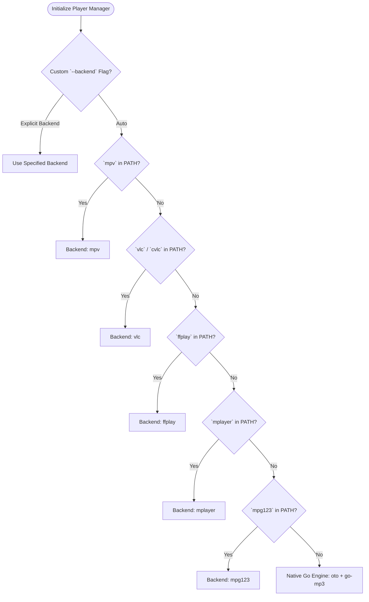

# Audio Engine & Player Architecture 🎵

The audio playback subsystem in `halpradio` is designed for maximum compatibility across macOS, Linux, and BSD systems. It uses a **multi-backend fallback architecture** with automatic binary detection, supplemented by a zero-dependency native Go audio driver.

---

## 🎧 Multi-Backend Audio Engine

When `halpradio` launches, [`player.NewManager`](../pkg/player/player.go) inspects the host system to auto-detect installed CLI media players.



### Supported Backends Summary:

| Backend | Binary | Executable Flags | Supported Codecs | Notes |
|---|---|---|---|---|
| **MPV** *(Recommended)* | `mpv` | `--no-video --quiet --volume=N` | MP3, AAC, OGG, FLAC, HLS, Opus | Best streaming stability & lowest latency. |
| **VLC / CVLC** | `vlc` / `cvlc` | `-I dummy --quiet --gain=N` | MP3, AAC, OGG, FLAC, HLS | Wide codec support, lightweight in dummy mode. |
| **FFplay** | `ffplay` | `-nodisp -loglevel quiet -volume N` | MP3, AAC, OGG, FLAC | Part of ffmpeg suite. |
| **MPlayer** | `mplayer` | `-quiet -volume N` | MP3, AAC, OGG | Traditional Linux media player. |
| **MPG123** | `mpg123` | `-q -g N` | MP3 | Lightweight MP3 decoder. |
| **Native Go** | Built-in | Direct PCM stream to host audio | MP3 | Zero external binary dependencies required. |

---

## 🔊 Native Go Audio Backend (`oto/v3` + `go-mp3`)

When no external media CLI is installed on the system, `halpradio` gracefully switches to its **native Go player engine**:
- **HTTP Streamer**: Initiates an HTTP GET request to the radio stream URL with customizable user agents.
- **MP3 Decoder**: Streams incoming bytes through `github.com/hajimehoshi/go-mp3`.
- **Audio Output**: Feeds decoded 16-bit PCM audio samples directly into hardware sound drivers via `github.com/ebitengine/oto/v3`.

> [!NOTE]
> The native Go player handles MP3 streams out of the box. For AAC/AAC+ streams, installing `mpv` or `ffmpeg` is recommended.

---

## 📻 Real-time ICY Metadata Extraction

Many Internet Radio stations (Icecast / Shoutcast) broadcast live song and artist information inside the HTTP stream via **ICY metadata**.

`halpradio` implements a dedicated, non-blocking ICY reader goroutine in [`startICYListener`](../pkg/player/player.go):

1. **Request Header**: Sends `Icy-MetaData: 1` HTTP request header.
2. **Metadata Interval Parsing**: Reads the `Icy-Metaint: N` response header, which specifies the exact byte interval between metadata chunks.
3. **Chunk Extraction**: Reads `N` audio bytes, followed by 1 byte indicating metadata length `L * 16`.
4. **Stream Title Parsing**: Extracts `StreamTitle='Artist - Song Title';` from the metadata payload.
6. **Sanitization**: Passes the extracted `StreamTitle` through `radio.SanitizeTrackTitle()` to remove ads, URLs, jingles, and radio promo noise before updating the TUI.

```
[ Audio Bytes (N) ] [ Meta Length (1 B) ] [ StreamTitle='Artist - Track'; ] [ Audio Bytes (N) ] ...
       │
       ▼
[ Sanitizer: Strips Ads / URLs / Jingles ]
       │
       ▼
[ Dispatches TrackInfo to UI Model ]
```

---

## 🧼 Dirty Metadata Sanitizer (`pkg/radio/sanitizer.go`)

Radio stations frequently inject disruptive promotional text, sponsor messages, jingles, and website URLs into their ICY metadata streams. `halpradio` sanitizes incoming stream titles automatically:

- **Ad & Sponsor Removal**: Strips promo phrases such as `Buy on somafm.com`, `Ad: ...`, `Sponsored by ...`, `Commercial Break`, `Support this station`.
- **URL & Slogan Cleansing**: Strips web addresses (`http://...`, `www....`), station slogans, frequency call signs (`104.5 FM`), and composite noise (`//`, `|`, `:::`, `***`).
- **MusicBrainz Sanity Checks**: Validates candidate track titles against recording schemas to eliminate false positive song names.
- **Deduplication**: Prevents redundant notification spam when metadata fluctuations only alter minor spacing or casing.

---

## 🔍 Acoustic Stream Fingerprinting (`pkg/player/fingerprint/`)

For stations that stream music without ICY track metadata, or when ICY tags are inaccurate, `halpradio` provides on-demand and automatic acoustic audio fingerprinting.

```mermaid
flowchart TD
    UserPress["User presses 'I' or Auto-Identify triggered"] --> CaptureBuffer["Capture 5s Audio Stream (PCM)"]
    
    CaptureBuffer --> CheckFFmpeg{"`ffmpeg` available?"}
    CheckFFmpeg -->|Yes| FFmpegCapture["Sample via ffmpeg: 11025Hz Mono S16LE"]
    CheckFFmpeg -->|No| GoCapture["Pure-Go Decoder: HTTP GET + go-mp3"]
    
    FFmpegCapture --> GenerateFP["Generate Chromaprint Subfingerprint"]
    GoCapture --> GenerateFP
    
    GenerateFP --> CheckFpcalc{"`fpcalc` available?"}
    CheckFpcalc -->|Yes| FpcalcCLI["Compute via fpcalc CLI"]
    CheckFpcalc -->|No| GoSTFT["Pure-Go STFT Spectral Subfingerprinter"]
    
    FpcalcCLI --> CheckCache{"Cached in LRU?"}
    GoSTFT --> CheckCache
    
    CheckCache -->|Cache Hit| ReturnResult["Return Cached Track Result"]
    CheckCache -->|Cache Miss| AcoustIDQuery["Query AcoustID API v2 (/v2/lookup)"]
    
    AcoustIDQuery --> MBQuery["Enrich with MusicBrainz Metadata"]
    MBQuery --> CacheResult["Store in TTL Cache (10m)"]
    CacheResult --> ReturnResult
    ReturnResult --> TUI["Display [✨ Identified (94%)] + Update History + Yank 'y'"]
```

### Key Subsystems:
1. **Audio Capture ([`pkg/player/fingerprint/capture.go`](../pkg/player/fingerprint/capture.go))**:
   - Streams 5 seconds of audio buffer converted to 11,025 Hz mono 16-bit PCM WAV.
   - Prefers host `ffmpeg` CLI when installed; falls back to pure-Go HTTP streaming and MP3 decoding if external binaries are missing.
2. **Fingerprint Engine ([`pkg/player/fingerprint/fingerprint.go`](../pkg/player/fingerprint/fingerprint.go))**:
   - Generates Chromaprint-compatible compressed subfingerprints.
   - Prefers `fpcalc` CLI; falls back to a pure-Go 16-band STFT (Short-Time Fourier Transform) subfingerprint generator.
3. **Lookup Client ([`pkg/player/fingerprint/client.go`](../pkg/player/fingerprint/client.go))**:
   - Queries `https://api.acoustid.org/v2/lookup` with open key `v8pQ6oyB` (or custom key in `config.yaml`).
   - Retrieves recording metadata, artist credits, album releases, and release year.
4. **LRU Cache ([`pkg/player/fingerprint/cache.go`](../pkg/player/fingerprint/cache.go))**:
   - Thread-safe in-memory cache with 10-minute TTL eviction, avoiding duplicate queries for the same song.
5. **UI Integration**:
   - Renders visual confidence bar (`████████░ 94%`) in the player bar.
   - Identified tracks populate the History tab (`H`) with a `✨` star badge.
   - System clipboard yank (`y`) automatically copies identified tracks.

---

## 🎛️ Volume & Mute Controls

Volume changes dynamically calculate backend-specific volume parameters:
- **MPV**: `0` to `100` volume argument.
- **VLC**: Gain multiplier `0.00` to `1.00`.
- **FFplay / MPG123**: Scale integer volume arguments.
- **Native Go**: Adjusts gain via `oto.Player.SetVolume(float64)`.

Muting preserves the previous volume level and toggles zero gain output across all backends.

