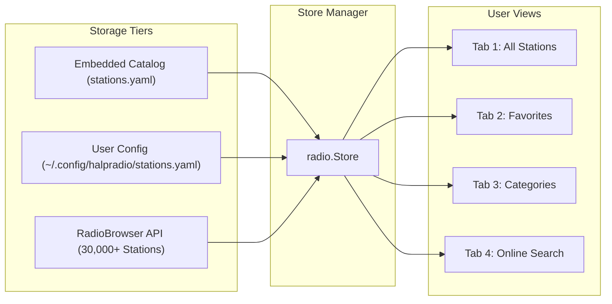

# Station Catalog & RadioBrowser Integration 📻

`halpradio` provides a flexible station management pipeline that combines bundled curated stations, custom local stations, online search via RadioBrowser API, and 1-click station sharing via GitHub PRs.

---

## 🗂️ Station Storage Architecture

Station entries are managed by [`radio.Store`](../pkg/radio/store.go) across three distinct storage tiers:



### 1. Bundled & Cached Catalog (`stations.yaml` & `catalog_cache.yaml`)
- **Embedded Release Baseline**: Included directly in the binary release via Go embed (`//go:embed stations.yaml`).
- **Dynamic Remote Sync (Aggressive Caching & Lightweight Check)**:
  - On launch, `halpradio` checks for updated catalog releases in the background.
  - **Zero Server Load**: Checks are throttled to once per 24 hours (`catalog_cache_ttl_hours: 24`). Within TTL, **zero network requests** are sent.
  - **Lightweight 304 Conditional Checks**: When checking, conditional HTTP headers (`If-None-Match` with ETag and `If-Modified-Since`) are sent. If the remote catalog has not changed, the server returns `304 Not Modified` with 0 body bytes.
  - **Strict Validation**: Downloaded YAML is strictly verified before caching to `~/.config/halpradio/catalog_cache.yaml`.
  - **CLI Update**: Run `halpradio update-stations` or `halpradio -update-catalog` to manually trigger an update.

### 2. Local Custom Stations (`~/.config/halpradio/stations.yaml`)
- Created or edited interactively using the **Add Station** dialog (`a` key binding).
- Persisted locally on the user's computer.
- Merged seamlessly into the main station list without modifying git workspace files.

### 3. Favorites (`~/.config/halpradio/favorites.json`)
- Toggled on any station with the `f` key binding.
- Stores complete station metadata, ensuring online RadioBrowser stations saved as favorites remain accessible across app restarts even when offline.

---

## 📄 Station YAML Schema

All station files (`stations.yaml` and `~/.config/halpradio/stations.yaml`) adhere to the following schema:

```yaml
stations:
  - id: station-unique-id
    name: "Station Name"
    url: "https://stream.example.com/live.mp3"
    genre: "Lofi / Chill"
    country: "US"           # 2-letter ISO country code (e.g. US, GB, SE, DE, FR, JP)
    bitrate: 128            # Stream bitrate in kbps (e.g. 128, 192, 320)
    codec: "MP3"            # MP3, AAC, OGG, etc.
    homepage: "https://example.com"
```

---

## 🌐 RadioBrowser API Integration

`halpradio` includes a built-in client ([`radio.RadioBrowserClient`](../pkg/radio/radiobrowser.go)) that connects to the public [RadioBrowser API](https://www.radio-browser.info/):

- **Endpoint**: `https://de1.api.radio-browser.info/json/stations/search`
- **Features**:
  - Top-voted global station listings.
  - Live keyword search by station name, tag, or country.
  - Automatic fallback stream URL resolution.
  - Stream metadata normalization (bitrate, codec, country flags).

Press `Tab` to navigate to the **Online Search** tab, type any genre or query (e.g., `synthwave`, `bbc`, `jazz`, `japan`), and press `Enter` to query thousands of live streams instantly.

---

## 🐙 GitHub PR Snippet Export Workflow (`p` Key)

To make expanding the public station catalog effortless for the community, `halpradio` includes an automatic snippet exporter:

1. Select any station in your list (or create a new station via `a`).
2. Press `p`.
3. `halpradio` automatically formats the station as clean YAML and writes it directly to your system clipboard (using platform utilities like `pbcopy` on macOS, `xclip`/`xsel` on Linux, or Windows clipboard).
4. Paste the snippet directly into [`stations.yaml`](../stations.yaml) and open a Pull Request!

```yaml
# Generated by pressing 'p' in halpradio
  - id: lofi-girl-radio
    name: "Lofi Girl Radio"
    url: "https://stream.example.com/lofi.mp3"
    genre: "Lofi"
    country: "FR"
    bitrate: 128
    codec: "MP3"
```
